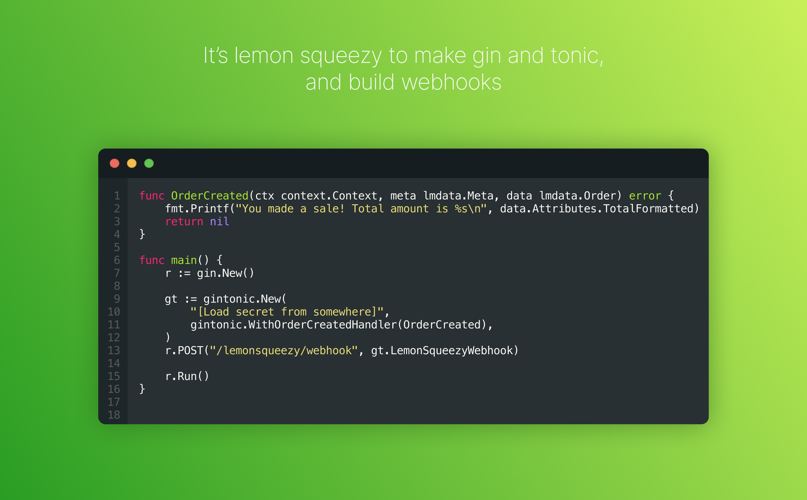

# Gin&Tonic



中文文档 | [Documentation](README.md)

## 介绍

Gin&Tonic 是一个用于 `gin` 开发框架构建 `LemonSqueezy` webhook 的库，可以让你快速、优雅地编写 `LemonSqueezy` webhook

## 快速上手

安装

```bash
go get -u github.com/YianAndCode/gintonic
```

引入项目

```go
import "github.com/YianAndCode/gintonic"
```

编写业务逻辑函数

```go
import (
	"context"
	"fmt"

	"github.com/YianAndCode/gintonic"
	"github.com/YianAndCode/gintonic/lmdata"
)

var _ gintonic.OrderCreatedHandler = OrderCreated

func OrderCreated(ctx context.Context, meta lmdata.Meta, data lmdata.Order) error {
	fmt.Printf("恭喜发财，进账 %s\n", data.Attributes.TotalFormatted)
	return nil
}
```

注册 gin 路由并启动
```go
func main() {
	r := gin.New()
	r.Use(gin.Recovery())

	gt := gintonic.New(
		"[Load secret from somewhere]",
		gintonic.WithOrderCreatedHandler(OrderCreated),
	)
	r.POST("/lemonsqueezy/webhook", gt.LemonSqueezyWebhook)

	r.Run()
}
```

## 定义

### 实例化

`gintonic` 的实例化非常简单，只需要通过 `New` 函数即可，第一个参数固定为 `secret`，之后是根据你的需要设置任意数量的 Handler：

```go
gt := gintonic.New(
    "[YOUR_SECRET]",
    gintonic.WithOrderCreatedHandler(OrderCreated), // 创建订单事件处理器
    gintonic.WithDefaultHandler(DefaultHandler),    // 默认处理器
)
```

设置 `Handler` 是用 `gintonic.With[EventName]Handler()` 选项函数来完成的，具体的函数可以在 `option.go` 中找到

### Handler

handler 的定义在 `handler.go`，分为两类：`Event Handler` 和 `DefaultHandler`。

它们的关系就像是 `switch` 语句中的 `case` 和 `default`，当你在 `New` gintonic 实例时，使用 `gintonic.WithXXXHandler(XXX)` 注册的 Handler 可以视为 `case`，当接收到 `webhook` 事件时，`gintonic` 会判断属于哪个 `case` 然后调用相应的 `handler`，如果找不到则会去找 `DefaultHandler`；如果找不到相应的 `Event Handler` 并且没有设置 `DefaultHandler`，那么将会返回一个错误。

`DefaultHandler` 的定义为：

```go
type DefaultHandler func(ctx context.Context, eventName string, meta lmdata.Meta, data interface{}) error
```

`Event Handler` 则形如：

```go
type OrderCreatedHandler func(ctx context.Context, meta lmdata.Meta, data lmdata.Order) error
```

只有 `data` 的类型是不一样的

### 核心

`gintonic` 与 `gin` 的交互使用的是 `GinTonic.LemonSqueezyWebhook` 方法，这个方法会从 `gin` 中读取 `HTTP Headers`、`POST body`，然后进行签名校验，通过后分发事件到注册好的 `handler`

所以我们只需要将 `GinTonic` 实例的 `LemonSqueezyWebhook` 方法注册到 `gin` 的路由即可
